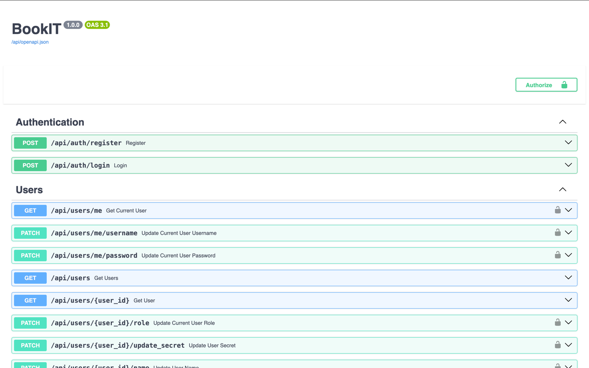
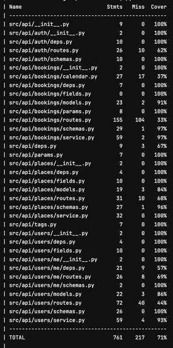
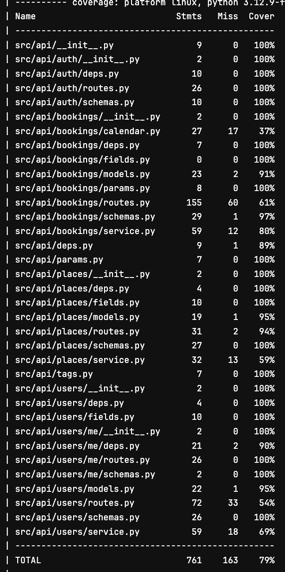

[](https://www.python.org)
[](https://pycodestyle.pycqa.org)
[](https://www.conventionalcommits.org)

# BookIT



Данный проект решает один из кейсов олимпиады PROOOD 2025 под названием BookIT. Это система для бронирования мест в
коворкинге с системой уведомлений и удобной админской панелью.

**Функциональные возможности проекта**

- Регистрация и авторизация пользователя
- Ролевая система пользователей:
    - Гость
    - Сотрудник/студент
    - Администратор
- Бронирование мест в коворкинге
- Просмотр собственных броней и их редактирование
- Верификация брони через QR-код
- Система администрирования:
    - Просмотр всех бронирований
    - Редактирование данных пользователей
    - Подтверждение брони пользователей через QR-код
    - Получение бизнесовой и технической статистики
- Получение уведомлений через телеграм и почту
- Возможность добавить бронь в календарь

**Технические решения:**

- JWT авторизация — безопасный способ аутентификации пользователей.
- Docker — использование `Dockerfile` и `docker compose` для контейнеризации приложения.
- Конфигурация — взаимодействие с переменными окружения
  через [pydantic_settings](https://docs.pydantic.dev/latest/concepts/pydantic_settings/).
- Типизирование — статическая проверка типизирования с использованием [pyright](https://github.com/microsoft/pyright/).
- Форматирование кода — автоматическое форматирование с помощью [ruff](https://docs.astral.sh/ruff/).
- Линтинг кода — проверка кода на соответствие стандартам с использованием [ruff](https://docs.astral.sh/ruff/).
- Тестирование — написание и выполнение тестов с помощью [pytest](https://pytest.org/)
  через [docker](https://www.docker.com/).

# Архитектура


## Структура бизнес-модулей

Каждый бизнес-модуль отражает конкретную функциональность, такую как управление пользователями или аутентификация.

```tree
module
├── __init__.py       # файл инициализации, импортирующий роутер
├── deps.py           # настройки зависимостей бизнес-модуля
├── fields.py         # переиспользуемые поля для схем
├── models.py         # модели базы данных
├── routes.py         # маршруты бизнес-модуля
├── schemas.py        # схемы для валидации данных
└── service.py        # сервисы с бизнес-логикой модуля
```

Импорты внутри модуля должны выглядеть следующим образом для избежания круговых зависимостей:


> При необходимости могут быть быстро введены собственные под-модули исходя из бизнес требований.

## Схема базы данных


Подробнее со структурой БД можно ознакомиться в файле [DATABASE.md](docs/DATABASE.md).

# Разработка

<!-- Работайте в отдельных ветках, чтобы не испортить главную ветку.

**Префиксы для веток:**

- `feat/*` — для новой функциональности.
- `test/*` — для тестирования.

Следуя этой структуре, вы сможете легко организовать и отслеживать изменения в проекте. -->

## Начало

### Шаг 1 — склонируйте репозиторий

Склонируйте репозиторий командой (предварительно настроив SSH-ключи):

```bash
git clone git@gitlab.com:prodcontest/template-backend.git
```

### Шаг 2 — установите зависимости

Для управления зависимостями в проекте используется пакетный менеджер [pip](https://pip.pypa.io).

Зависимости организованы следующим образом:

```tree
requirements
├── common.txt  # общие зависимости
├── dev.txt     # зависимости для разработки
└── prod.txt    # зависимости для продакшена
```

Чтобы установить нужную группу зависимостей, выполните одну из команд ниже, предварительно перейдя в папку backend
командой `cd backend`:

```bash
pip install -r requirements/dev.txt
```

```bash
pip install -r requirements/prod.txt
```

### Шаг 3 — настройте окружение

Для запуска приложения через docker достаточно скопировать пример файла конфигурации окружения:

```bash
cp .env.example .env
```

После выполнения этой команды у вас будет создан файл `.env`, который содержит все необходимые переменные окружения.

## Типизация

В проекте используется строгое статическое типизирование с помощью pyright, и для проверки типов необходимо выполнить:

```bash
pyright
```

## Форматирование

Для поддержания единого код-стиля используйте форматер:

```bash
ruff format
```

## Линтинг

Чтобы проверить код на соответствие стандартам проекта и автоматически исправить проблемы, выполните:

```bash
ruff check --fix
```

# Тестирование

Тесты запускаются в докере для полной изоляции.

В проекте есть два вида тестов: unit-тесты и e2e-тесты

## Unit-тесты

Покрытие Unit-тестами:



Они проверяют основной функционал сервисов с замокаными данными. Чтобы запустить контейнер с unit-тестами, выполните
следующую команду:

```bash
docker compose --profile unit-test up --build --abort-on-container-exit
```

Для удаления контейнеров с тестами используйте:

```bash
docker compose --profile tes t down -v
```

## e2e тесты

Покрытие E2E-тестами:



e2e-тесты проверяют пользовательские пути, уже без замоканых данных и по созданию запросов к REST API. Они покрывают
основные пользовательские пути: создание, получение, редактирование, удаление разных сущностей. Причём
каждый блок тестов начинается с нуля, как если бы в это время регистрировался новый пользователь. Тесты покрывают модули
с авторизацией, учётными записями, местами и бронированиями.

### Тестовые сценарии

- Регистрация, включая использование неправильных данных и их валидацию
- Авторизация, включая использование неправильных данных и их валидацию
- Получение самого себя, редактирование своих параметров
- Получение пользователей (включая валидацию)
- Получение мест для бронирования и их редактирование
- Получение собственных бронирований
- Создание, редактирование бронирований
- Получение бронирований по местам
- Получение загруженности мест
- Получение текущих бронирований

Для запуска контейнера с e2e тестами выполните следующую команду:

```bash
docker compose --profile test up --build --abort-on-container-exit
```

Для удаления контейнеров с тестами используйте:

```bash
docker compose --profile test down -v
```

# Развёртывание

У проекта есть два профиля: `prod` и `dev`.
На dev фронтенд запускается в режиме разработки, автоматически подтягивая изменения в браузере. Не запускаются grafana и
prometheus. nginx использует порт 8080 без SSL сертификатов.

Для запуска контейнера с приложением выполните следующую команду:

```bash
docker compose --profile prod up -d --build
```

Для остановки контейнера обязательно указывайте профиль:

```bash
docker compose --profile prod down -v
```
