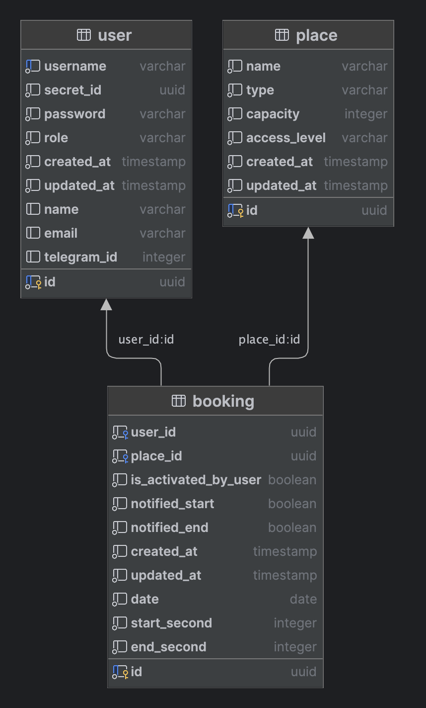

# В данном файле располагается структура базы данных

База данных состоит из таблиц:

* `user` - таблица пользователей. Содержит в себе следующие поля:
    * `id` - уникальный идентификатор пользователя
    * `username` - логин пользователя
    * `password` - пароль пользователя
    * `role` - роль пользователя, может быть `guest`, `student` или `admin`
    * `secret_id` - секрет пользователя, используется для обновления промокода для идентификации пользователя
    * `name` - ФИО пользователя
    * `email` - электронная почта пользователя
    * `telegram_id` - id пользователя в Telegram
    * `created_at` - дата создания пользователя
    * `updated_at` - дата обновления пользователя
* `place` - таблица мест, которые можно забронировать. Содержит в себе следующие поля:
    * `id` - уникальный идентификатор места
    * `name` - название места
    * `type` - тип места, может быть `seat` (одиночное место) или `room` (переговорка)
    * `capacity` - вместимость места
    * `access_level` - уровень доступа к месту, может быть `guest` или `student`
    * `created_at` - дата создания места
    * `updated_at` - дата обновления места
* `booking` - таблица бронирований. Содержит в себе следующие поля:
    * `id` - уникальный идентификатор бронирования
    * `user_id` - идентификатор пользователя, который забронировал место
    * `place_id` - идентификатор места, которое забронировал пользователь
    * `date` - дата бронирования
    * `start_second` - время начала бронирования в секундах
    * `end_second` - время окончания бронирования в секундах
    * `is_activated_by_user` - флаг, указывающий, было ли бронирование пользователя подтверждено админом
    * `notified_start` - флаг, указывающий, было ли уведомление о начале бронирования отправлено пользователю
    * `notified_end` - флаг, указывающий, было ли уведомление о конце бронирования отправлено пользователю
    * `created_at` - дата создания бронирования
    * `updated_at` - дата обновления бронирования
