# template-frontend-csr

## Архитектура

Этот проект использует [Feature-Sliced ​​Design](https://feature-sliced.design/docs/get-started/overview) (FSD) — это архитектурная методология для проектирования фронтенд-приложений. Проще говоря, это набор правил и соглашений по организации кода. Главная цель этой методологии — сделать проект понятнее и стабильнее в условиях постоянно меняющихся бизнес-требований.


## Авторизация

В приложении реализована регистрация

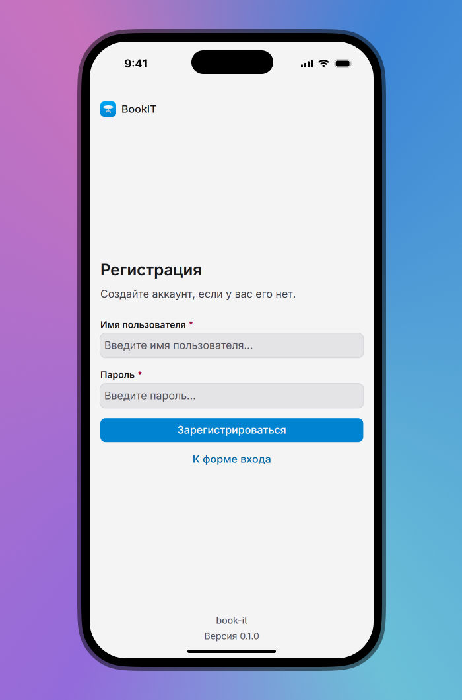

Чтобы упростить процесс авторизации, на странице логина была добавлена возможность быстрого входа под пользователем с определённой ролью по нажатию кнопки:

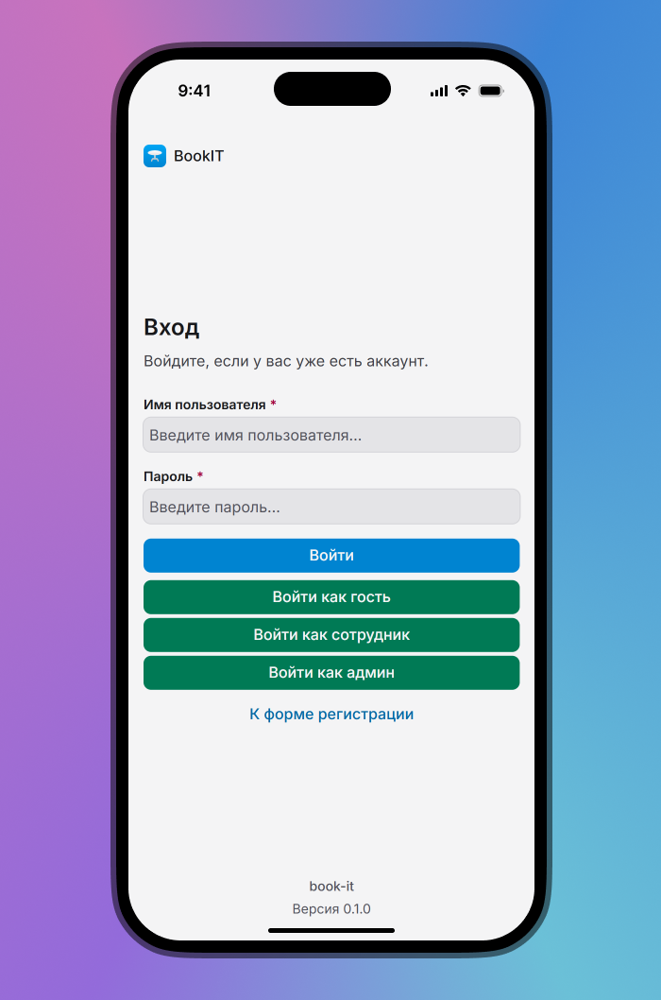

## Бронирование

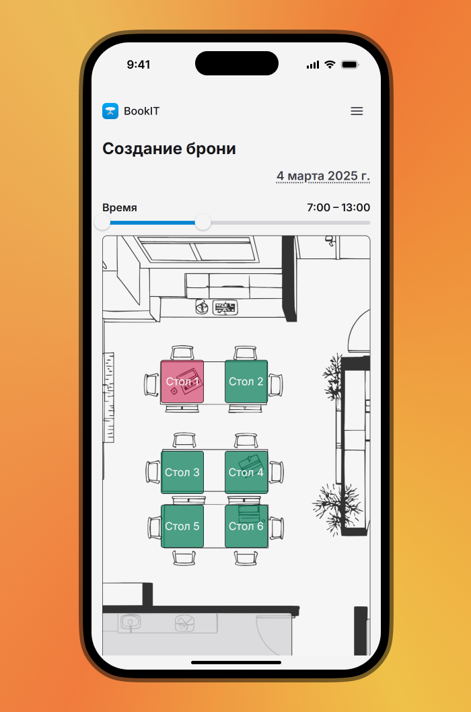

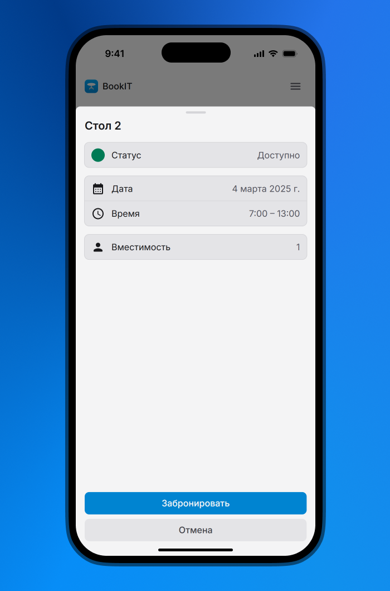

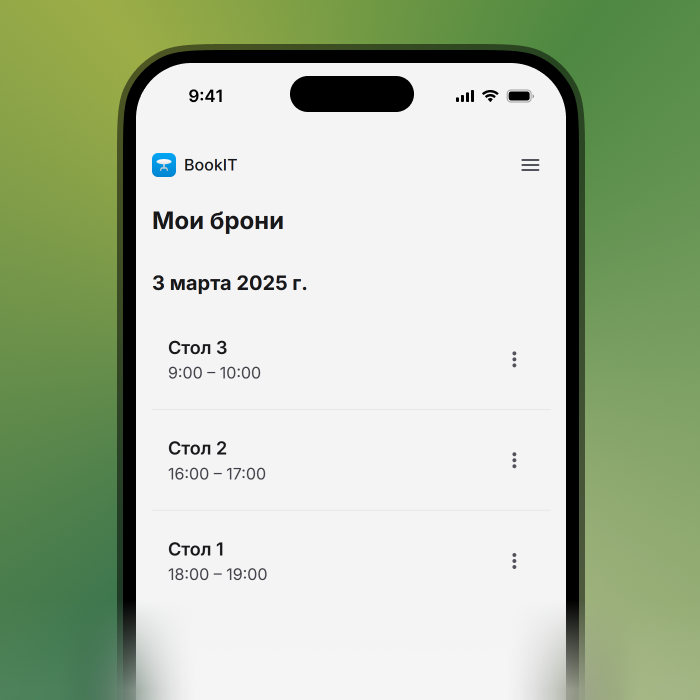

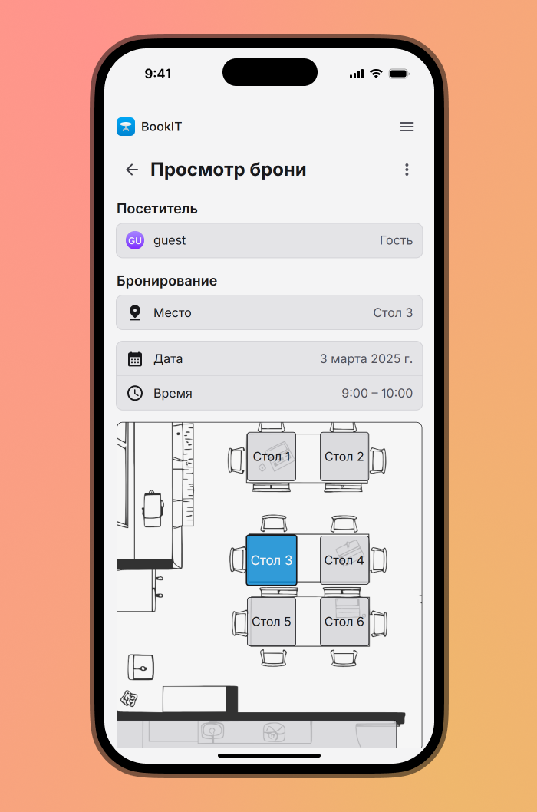

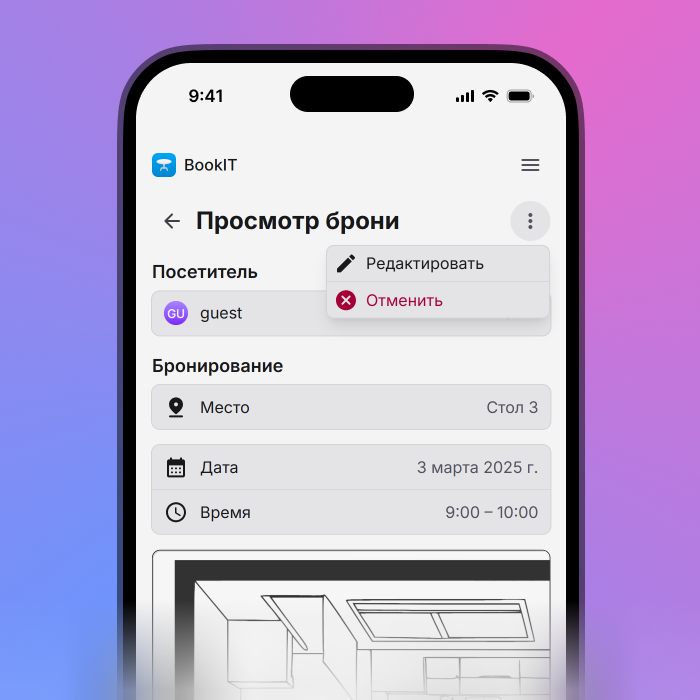

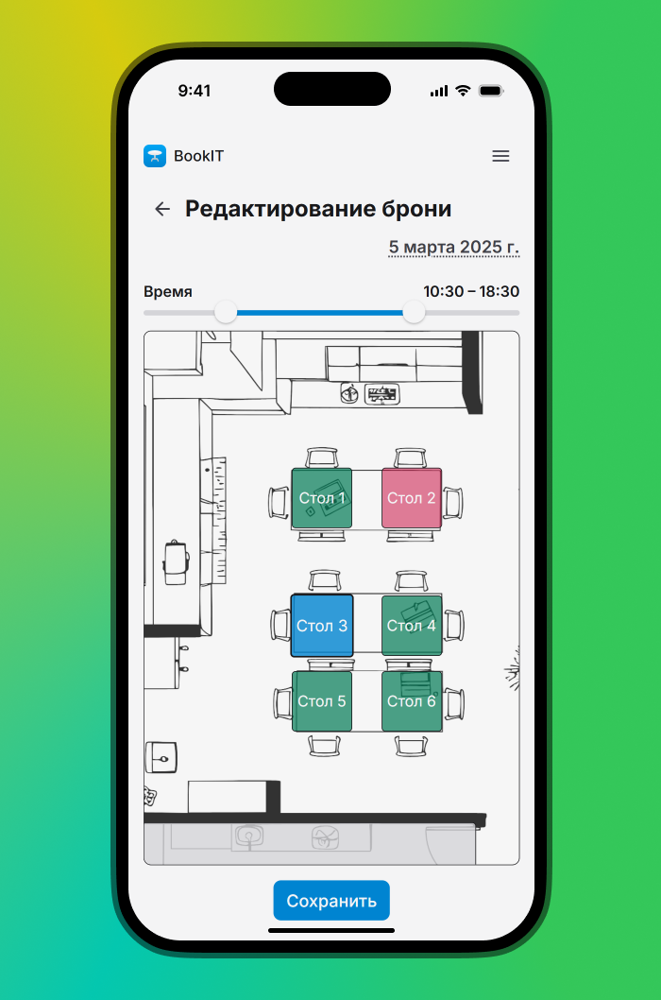

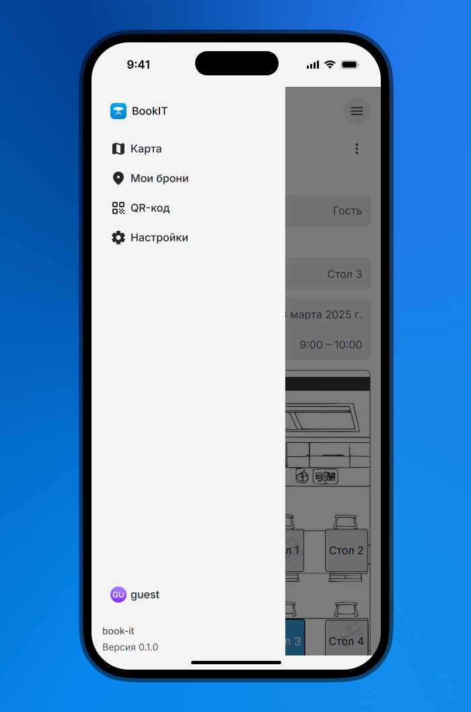

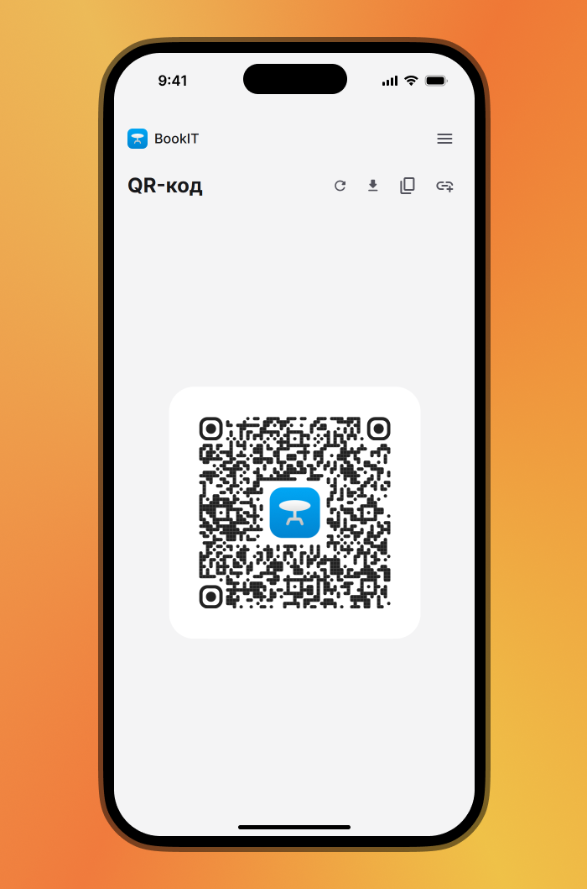

## Админ

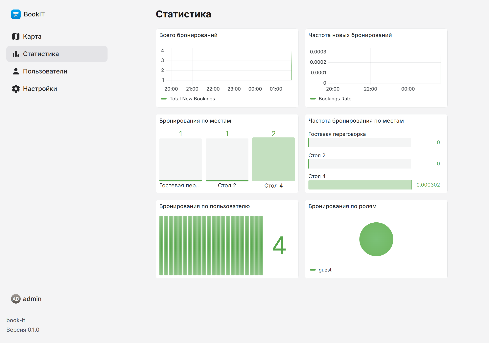

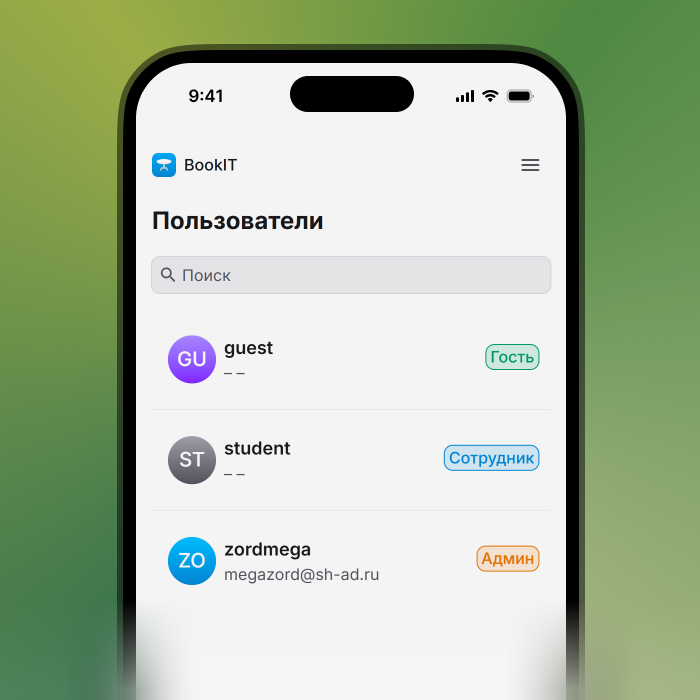

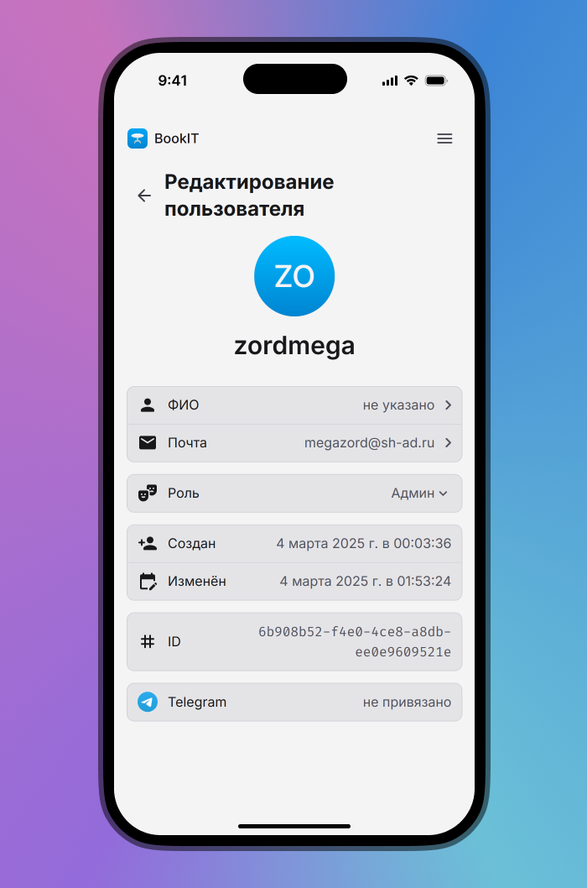

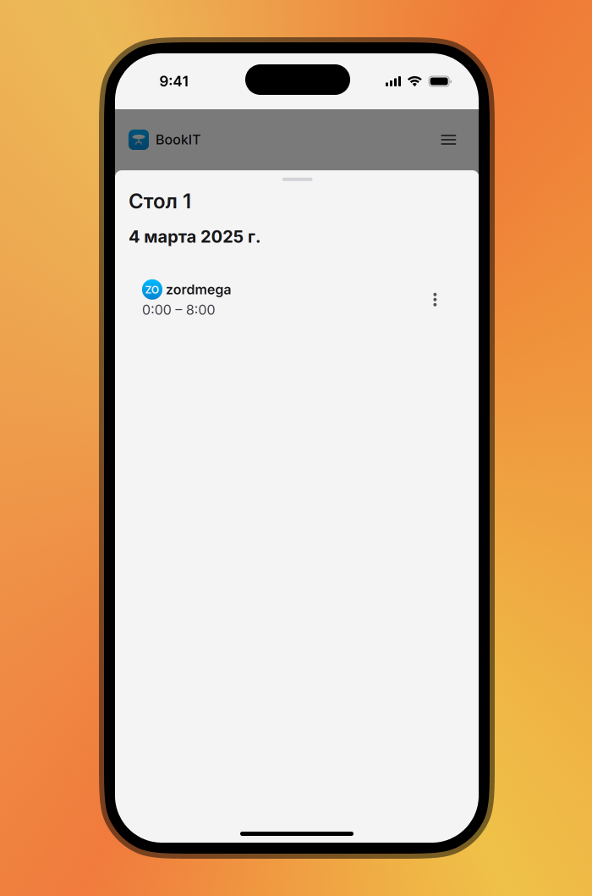

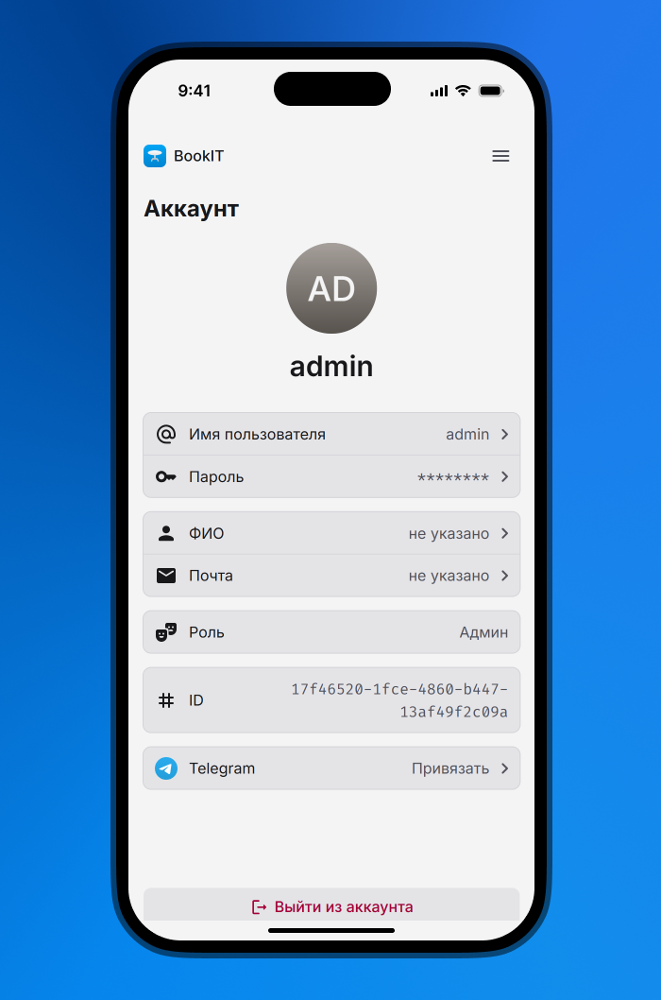

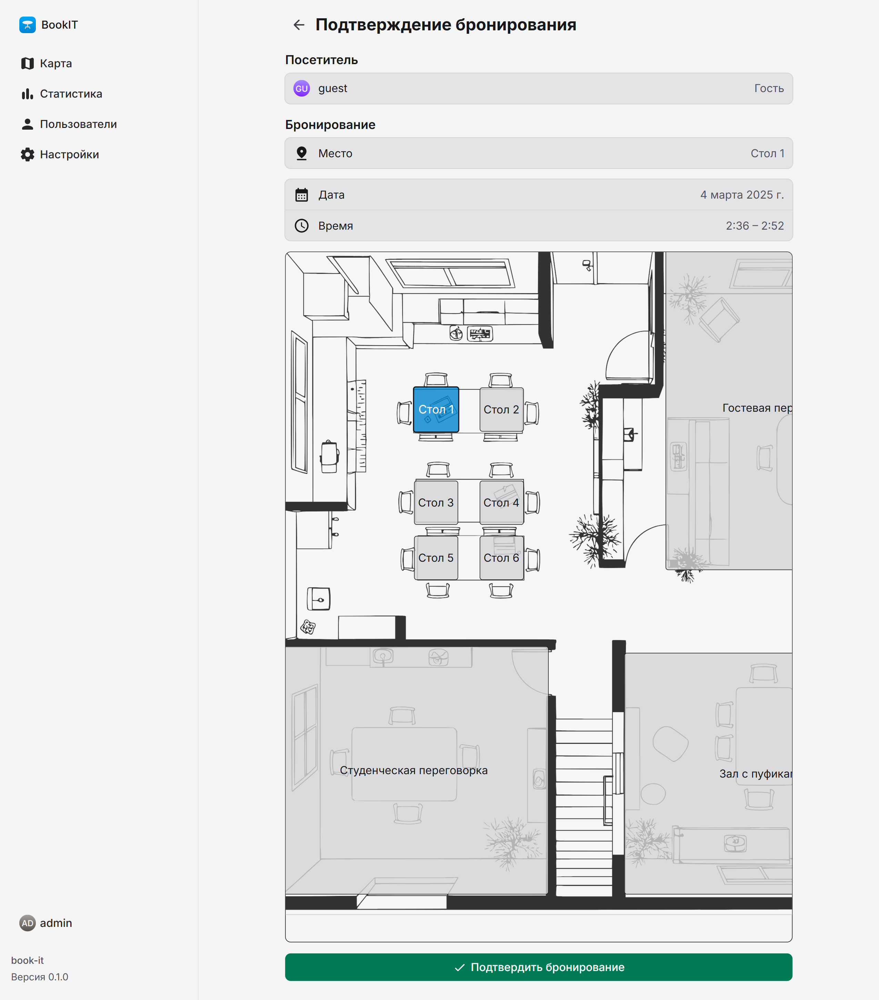

| Технология                               | Описание                                                                                                                                                            |
| ---------------------------------------- | ------------------------------------------------------------------------------------------------------------------------------------------------------------------- |
| [Vite](https://vite.dev/)                | Быстрый инструмент для разработки и сборки приложений. Позволяет мгновенно видеть изменения в коде без перезагрузки страницы.                                       |
| [Solid](https://docs.solidjs.com/)       | Библиотека для создания пользовательских интерфейсов. Обеспечивает высокую производительность и реактивность, позволяя легко создавать сложные интерфейсы.          |
| [Tailwind CSS](https://tailwindcss.com/) | Утилитарный CSS-фреймворк, который позволяет быстро стилизовать элементы с помощью готовых классов. Упрощает процесс разработки и поддерживает единообразие стилей. |

Установка зависимостей:

```bash
pnpm i
```

Запуск в режиме разработки:

```bash
pnpm dev
```

Сборка проекта:

```bash
pnpm build
```

Предварительный просмотр сборки:

```bash
pnpm preview
```

Проверка кода на наличие ошибок:

```bash
pnpm lint
```

Форматирование кода:

```bash
pnpm format
```

## Тестирование

| Технология                    | Описание                                                                                                                        |
| ----------------------------- | ------------------------------------------------------------------------------------------------------------------------------- |
| [Vitest](https://vitest.dev/) | Быстрый тестовый фреймворк для JavaScript и TypeScript, который поддерживает модульное тестирование и тестирование компонентов. |

Запуск проверки типизации:

```bash
pnpm test:tsc
```

Запуск модульных тестов (находятся в [./src/](./src/)):

```bash
pnpm test:unit
```
